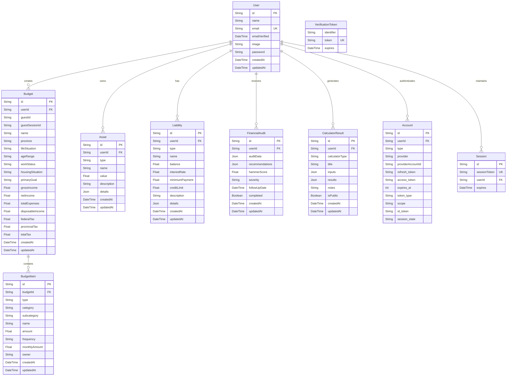

# Database Entity Relationship Diagram (ERD)

## SmartBudget Canada Database Schema

This document provides a visual representation of the database schema for the SmartBudget Canada application.



## Key Relationships

### Primary Relationships
- **User → Budget**: One-to-Many (A user can have multiple budgets)
- **Budget → BudgetItem**: One-to-Many (A budget contains multiple income/expense items)
- **User → Asset**: One-to-Many (A user can have multiple assets)
- **User → Liability**: One-to-Many (A user can have multiple liabilities)

### Guest System Relationships
- **Budget.guestId**: Legacy guest tracking system
- **Budget.guestSessionId**: New guest session tracking for migration
- **Budget.userId**: Links to authenticated user (null for guest budgets)

### Authentication Relationships
- **User → Account**: One-to-Many (OAuth providers)
- **User → Session**: One-to-Many (Active sessions)
- **VerificationToken**: Standalone for email verification

## Migration System Architecture

The guest-to-user migration system uses the following fields:

```sql
-- Legacy guest budgets
SELECT * FROM Budget WHERE guestId IS NOT NULL AND userId IS NULL;

-- New guest session budgets  
SELECT * FROM Budget WHERE guestSessionId IS NOT NULL AND userId IS NULL;

-- Migration query (simplified)
UPDATE Budget 
SET userId = ?, guestId = NULL, guestSessionId = NULL 
WHERE (guestId = ? OR guestSessionId = ?) AND userId IS NULL;
```

## Indexes

The following indexes are applied for optimal performance:

- `Budget.guestId` - Index for guest budget queries
- `Budget.guestSessionId` - Index for session-based guest queries
- `Budget.userId` - Foreign key index for user budgets
- `User.email` - Unique index for authentication
- `Session.sessionToken` - Unique index for session lookup

## Data Types

### Enums
```typescript
enum ItemType {
  INCOME
  EXPENSE
}

enum Frequency {
  WEEKLY
  BIWEEKLY  
  MONTHLY
  QUARTERLY
  YEARLY
}
```

### JSON Fields
- **FinancialAudit.auditData**: Structured audit information
- **FinancialAudit.recommendations**: AI-generated recommendations
- **Asset.details**: Asset-specific metadata
- **Liability.details**: Liability-specific metadata
- **CalculatorResult.inputs**: Calculator input parameters
- **CalculatorResult.results**: Calculated results and charts

## Security Considerations

- **guestId/guestSessionId**: Used for anonymous budget tracking
- **Password**: Hashed using bcryptjs
- **Session tokens**: Managed by NextAuth.js
- **HTTP-only cookies**: Secure guest session management

## Generating PNG ERD

To generate a PNG version of this ERD from the Prisma schema:

```bash
# Install prisma-erd-generator
npm install -g prisma-erd-generator

# Generate ERD
npx prisma generate
prisma-erd-generator --schema=./prisma/schema.prisma --output=./docs/database-erd.png
```

Alternative tools:
- [Prisma ERD Generator](https://github.com/keonik/prisma-erd-generator)
- [DBDiagram.io](https://dbdiagram.io/) with Prisma schema import
- [DrawSQL](https://drawsql.app/) with PostgreSQL import
